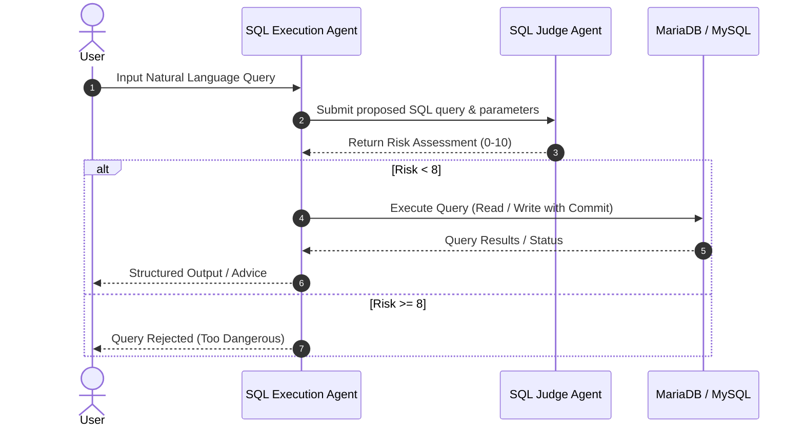

# AITest - AI-Powered Natural Language SQL Assistant

`aitest` is an AI-driven SQL query management assistant built with [PydanticAI](https://github.com/pydantic/pydantic-ai). It allows users to query and manipulate a MySQL / MariaDB database using natural language commands while enforcing safety guardrails through a dedicated secondary AI Judge agent.

---

## 🌟 Key Features

* **Dual-Agent Architecture**:
  * **SQL Execution Agent**: Translates natural language queries into safe, parameterized SQL (`%s` placeholders) aware of the database schema.
  * **SQL Judge Agent**: Evaluates every generated SQL query prior to execution, assessing risk factors such as destructive DDL (`DROP`, `ALTER`), prompt injection, and cross-user data access. Rejects queries with a risk index $\ge 8$.
* **Model Fallback System**: Combines primary models (e.g., Google Gemini) with fallback providers (e.g., Groq Llama 3.3 70B) via PydanticAI's `FallbackModel`.
* **Dynamic Database Context**: Automatically inspects table structures (`DESCRIBE users`, `DESCRIBE notes`) to provide context-aware query generation.
* **Thread-Safe Connection Manager**: Async and sync MySQL database connection management with standard transaction rollbacks and logging.
* **Configurable Data Seeding**: Controlled via environment variables (`SEED_DB`), avoiding unexpected data wipes on normal app execution.

---

## 🏗️ Project Architecture

```
AITest/
├── controllers/
│   └── sql_agent.py                 # SQL Agent & SQL Judge Agent implementation
├── models/
│   ├── note.py                      # Dataclass model for Note entity
│   └── user.py                      # Dataclass model for User entity
├── services/
│   ├── notes_service.py             # Service for notes table queries and schemas
│   └── user_service.py              # Service for users table queries and schemas
├── seeders/
│   └── db_seeder.py                 # Database creation and mock data seeder using Faker
├── Logs/                            # Application logs output directory
├── database_connection_manager.py   # MySQL/MariaDB context manager (Sync & Async)
├── logger.py                        # File logging utility
├── main.py                          # Application entry point (with __main__ guard)
├── pyproject.toml                   # Project configuration and dependencies (uv)
├── .env                             # Environment variables configuration
└── architectural_improvements.md   # Structural and refactoring roadmap
```

---

## 📋 Prerequisites

* **Python**: $\ge 3.12$
* **Database**: MySQL or MariaDB instance
* **Package Manager**: [`uv`](https://github.com/astral-sh/uv) (recommended) or `pip`

---

## ⚙️ Environment Setup

Create a `.env` file in the root directory with the following variables:

```env
# AI Model Credentials
GOOGLE_API_KEY=your_google_api_key
GOOGLE_API_MODEL='gemini-3.5-flash-lite'

GROQ_API_KEY=your_groq_api_key

# Database Credentials
DB_USER=root
DB_PASSWORD=your_db_password
DB_HOST=localhost
DB_PORT=3306
DB_NAME=test_db

# Database Seeding Control (Set true to re-seed tables on launch)
SEED_DB=false
```

---

## 🚀 Installation & Running

1. **Clone the repository**:
   ```bash
   git clone <repository-url>
   cd AITest
   ```

2. **Install dependencies**:
   Using `uv`:
   ```bash
   uv sync
   ```

3. **Run the application**:
   - **Normal Execution** (preserves database state):
     ```bash
     uv run python main.py
     ```
   - **Execution with Database Re-Seeding**:
     ```bash
     SEED_DB=true uv run python main.py
     ```

---

## 🛡️ Safety & Execution Flow



---

## 🧰 Dependencies

* [`pydantic-ai`](https://pydantic.dev/pydantic-ai/) - Framework for building production-grade AI agents.
* [`mysql-connector-python`](https://dev.mysql.com/doc/connector-python/en/) - Official MySQL driver for Python.
* [`faker`](https://faker.readthedocs.io/) - Generation of realistic mock data for database seeding.
* [`python-dotenv`](https://github.com/theskumar/python-dotenv) - Environment variable management.
* [`pydantic`](https://docs.pydantic.dev/) - Data validation using Python type annotations.
